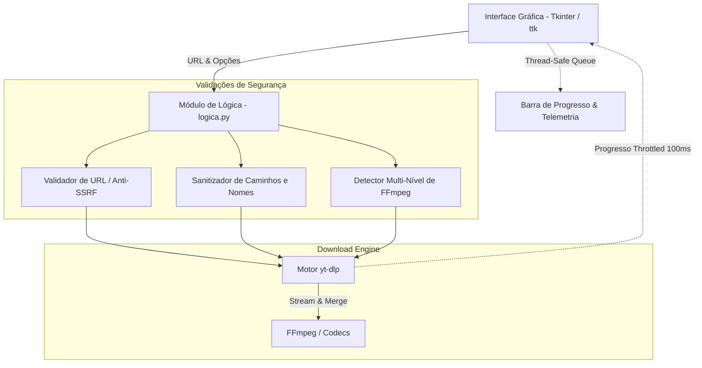

# ⚡ MultDownloader

<div align="center">


**Uma aplicação desktop moderna, rápida e segura para download e extração de vídeos e áudios de múltiplas plataformas.**

[Funcionalidades](#-funcionalidades-principais) •
[Instalação](#-instalação-e-configuração) •
[Guia do FFmpeg](#-configuração-do-ffmpeg) •
[Como Usar](#-como-utilizar) •
[Arquitetura](#-arquitetura-e-segurança) •
[Licença](#-licença)

</div>

---

## 📖 Visão Geral

O **MultDownloader** é um utilitário desktop desenvolvido em Python focado em praticidade, alta performance e interface intuitiva. Utilizando o poderoso motor [yt-dlp](https://github.com/yt-dlp/yt-dlp), o aplicativo permite baixar mídias em diversas resoluções (Full HD 1080p, 720p, 480p, etc.) ou extrair áudios em alta fidelidade (MP3 320kbps / 192kbps e M4A) com telemetria detalhada em tempo real.

---

## ✨ Funcionalidades Principais

- 🌐 **Suporte Multiplataforma**: Compatível com YouTube, Instagram (Reels/Vídeos), Facebook, TikTok, Twitter/X, Twitch, SoundCloud, Vimeo e mais de 1.000 sites suportados pelo yt-dlp.
- 📊 **Telemetria e Progresso Visual em Tempo Real**:
  - Barra de progresso gráfica precisa (`ttk.Progressbar`).
  - Velocidade de transferência dinâmica (ex: `12.5 MB/s`).
  - Tamanho baixado vs. total estimado (ex: `45.2 MB / 120.0 MB`).
  - Tempo estimado de conclusão (ETA).
- 🎬 **Prévia Inteligente de Metadados**: Identifica automaticamente título, autor/canal, duração e plataforma de origem assim que o link é inserido.
- 📋 **Ações Rápidas de UX**:
  - Botão **Colar da Área de Transferência** com detecção instantânea.
  - Botão **Abrir Pasta** para acessar o destino no Windows Explorer/Finder com um clique.
  - Seleção persistente da pasta de salvamento (padrão: pasta *Downloads* do usuário).
- ⏹ **Cancelamento Seguro**: Interrupção limpa de downloads a qualquer momento sem travar a interface.
- 🎨 **Interface Escura Sofisticada**: Design moderno *Dark Slate & Teal* com renderização fluida e thread-safe.
- 🔒 **Segurança Reforçada**:
  - Sanitização rigorosa de URLs (bloqueio de esquemas perigosos como `file://`, `ftp://`, SSRF).
  - Sanitização de caminhos e nomes de arquivos contra *Path Traversal* e caracteres inválidos no Windows.
  - Detecção inteligente do FFmpeg no sistema ou em pasta local.

---

## 🛠️ Tecnologias Utilizadas

- **Linguagem**: Python 3.10+
- **Interface Gráfica (GUI)**: Tkinter + `ttkthemes` (Tema Clam estilizado)
- **Motor de Download**: `yt-dlp`
- **Processamento de Mídia**: `FFmpeg`
- **Manipulação de Ícones**: `Pillow` (PIL)

---

## 🚀 Instalação e Configuração

### 1. Pré-requisitos
- **Python 3.10 ou superior** instalado ([Download Python](https://www.python.org/downloads/)).
- **FFmpeg** instalado (recomendado para mesclagem 1080p e conversão de áudio MP3).

### 2. Clonando o Repositório

```bash
git clone https://github.com/JoadsonRocha/MultDownloader.git
cd MultDownloader
```

### 3. Criando um Ambiente Virtual (Opcional, porém recomendado)

```bash
# Windows
python -m venv venv
.\venv\Scripts\activate

# Linux / macOS
python3 -m venv venv
source venv/bin/activate
```

### 4. Instalando as Dependências

```bash
pip install -r requirements.txt
```

---

## 🎥 Configuração do FFmpeg

O **FFmpeg** é essencial para mesclar fluxos separados de vídeo e áudio em alta definição (1080p+) e converter áudios para MP3.

### No Windows (Recomendado):

Você pode instalar o FFmpeg com apenas um comando no terminal:

```powershell
# Via WinGet (Nativo do Windows 10/11)
winget install Gyan.FFmpeg

# Ou via Chocolatey
choco install ffmpeg

# Ou via Scoop
scoop install ffmpeg
```

> **Alternativa Portátil**: Você também pode baixar o executável do FFmpeg em [gyan.dev/ffmpeg/builds](https://www.gyan.dev/ffmpeg/builds/) e colocar o `ffmpeg.exe` dentro de uma pasta chamada `ffmpeg/bin/` na raiz do projeto. O MultDownloader detectará automaticamente!

### No Linux:
```bash
# Ubuntu / Debian
sudo apt update && sudo apt install ffmpeg

# Fedora
sudo dnf install ffmpeg

# Arch Linux
sudo pacman -S ffmpeg
```

### No macOS:
```bash
brew install ffmpeg
```

---

## 💻 Como Utilizar

1. **Inicie a aplicação**:
   ```bash
   python main.py
   # ou
   python interface.py
   ```

2. **Cole a URL da mídia**:
   - Clique em **📋 Colar** ou use o atalho `Ctrl+V`.
   - O aplicativo buscará automaticamente o título, duração e autor da mídia.

3. **Selecione o Formato / Qualidade**:
   - `Melhor Qualidade (Auto)`: Seleciona automaticamente o melhor vídeo + áudio disponível.
   - `1080p Full HD`, `720p HD`, `480p SD`, `360p`.
   - `Áudio MP3 (320 kbps)`: Extração de áudio em altíssima fidelidade.
   - `Áudio MP3 (192 kbps)` / `Áudio M4A / AAC`.

4. **Escolha o Destino**:
   - Por padrão, os arquivos são salvos na sua pasta **Downloads**.
   - Clique em **📁 Procurar** para alterar ou **📂 Abrir** para visualizar a pasta.

5. **Clique em `⬇ Iniciar Download`**:
   - Acompanhe a velocidade, tamanho baixado e porcentagem em tempo real!

---

## 🏗️ Arquitetura e Segurança



### Destaques de Engenharia:
- **Thread Safety com Queue**: A interface não bloqueia ou congela durante downloads pesados. Todas as atualizações gráficas são processadas no loop principal do Tkinter através de filas seguras.
- **Throttling de Eventos**: As centenas de callbacks emitidos pelo yt-dlp são filtradas para ~10 atualizações por segundo, economizando ciclos de CPU e mantendo a interface fluida.
- **Isolamento e Sanitização**: URLs fora dos protocolos `http` e `https` são descartadas, prevenindo explorações locais.

---

## 📂 Estrutura do Projeto

```text
MultDownloader/
├── interface.py         # Interface gráfica principal e controles
├── logica.py            # Motor de download, validações e detecção de FFmpeg
├── main.py              # Ponto de entrada simplificado
├── test_logica.py       # Suíte de testes unitários automatizados
├── requirements.txt     # Dependências Python versionadas
├── logo.ico             # Ícone oficial da aplicação
├── LICENSE              # Licença MIT
└── README.md            # Documentação completa
```

---

## 🧪 Executando os Testes

Para rodar os testes unitários automatizados de validação de URL, cálculo de telemetria e integração:

```bash
python test_logica.py
```

---

## 🤝 Contribuição

Contribuições são sempre bem-vindas! Siga os passos abaixo:

1. Faça um Fork do projeto.
2. Crie uma branch para sua funcionalidade (`git checkout -b feature/NovaFuncionalidade`).
3. Faça commit das suas alterações (`git commit -m 'Adiciona NovaFuncionalidade'`).
4. Envie para o branch (`git push origin feature/NovaFuncionalidade`).
5. Abra um Pull Request.

---

## 📄 Licença

Distribuído sob a licença **MIT**. Consulte o arquivo [`LICENSE`](LICENSE) para obter mais informações.

<div align="center">
Desenvolvido com 💙 por <b>Joadson Rocha</b> e comunidade.
</div>
